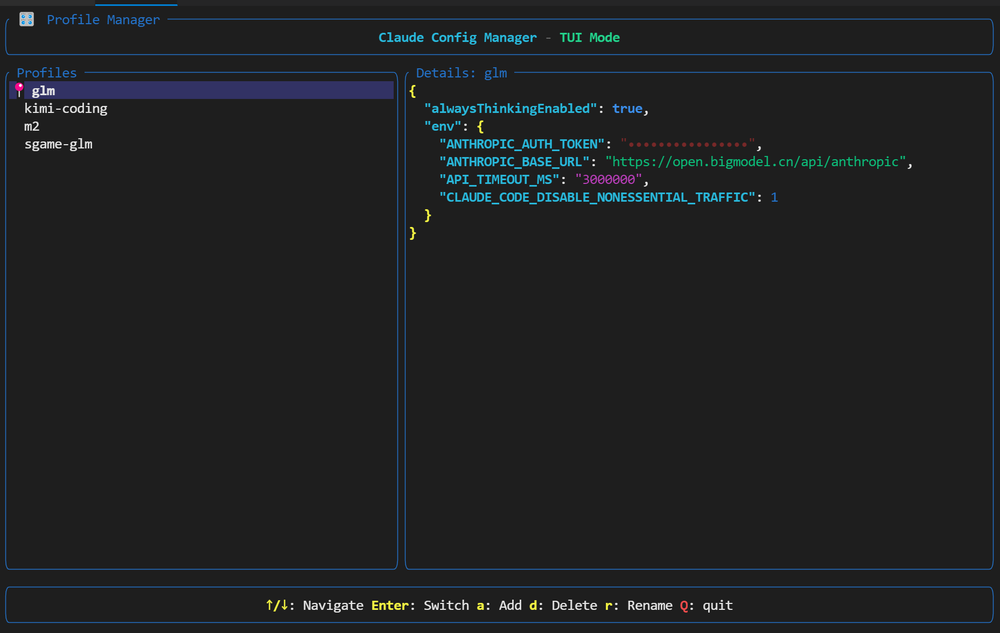
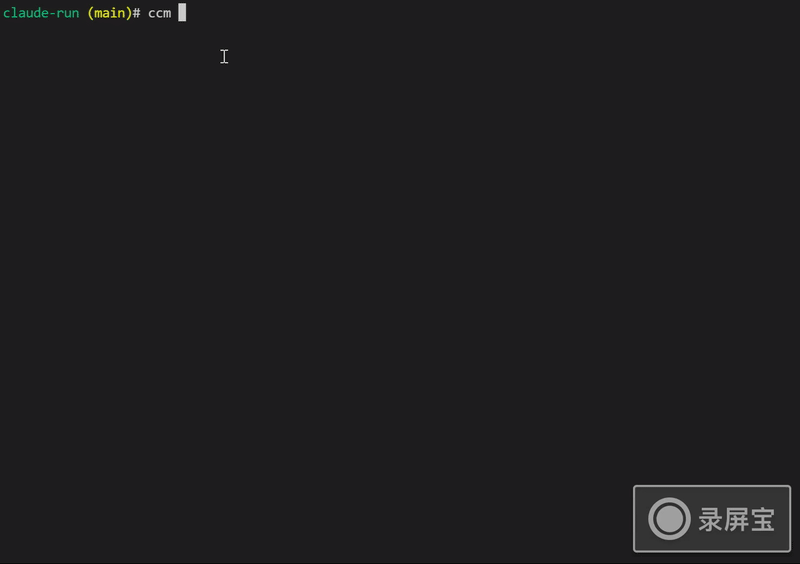

# Claude Config Manager

A command line tool to manage multiple Claude Code configuration profiles with interactive prompts. Easily switch between different providers and models, and launch Claude with a specific configuration.


## UI Mode

#

## CLI Mode
#

<!-- TOC -->
## Contents

- [Usage](#usage)
- [Claude Replacement Providers](#claude-replacement-providers)
- [Installation](#installation)
	- [Download pre-built binary](#download-pre-built-binary)
	- [Build from source](#build-from-source)
- [Example workflow](#example-workflow)
- [Defaults](#defaults)
<!-- /TOC -->

## Usage

**Note**: Commands support short aliases:
- `list` → `ls`
- `remove` → `rm`
- `switch` → `swc`

### Enter UI mode

```bash
ccm ui
```

### Add a profile (interactive)

```bash
ccm add openai-gpt4
```

You'll be prompted for some questions to set up the profile.

**Note**: Make sure the provider supports anthropic-compatible API.

### List all profiles

```bash
ccm ls
```

Output:
```
- openai-gpt5
- self-deploy-kimi-k2 (current)
- some-router-glm
- some-router-claude-sonnet-45
```

The current active profile will be marked with `(current)`.

### Import current Claude settings

```bash
ccm import my-backup
```

This saves your current `~/.claude/settings.json` as a new profile named `my-backup`, and marks it as current.

### Show profile content

```bash
ccm show openai-gpt5
```

Output:
```
ANTHROPIC_BASE_URL=https://api.openai.com/v1
ANTHROPIC_AUTH_TOKEN=sk-********
ANTHROPIC_MODEL=gpt-5
API_TIMEOUT_MS=300000
ANTHROPIC_SMALL_FAST_MODEL=gpt-5-mini
```

### Switch to a profile

```bash
ccm swc openai-gpt4
```

This replaces your current `~/.claude/settings.json` with the selected profile and marks it as current.

### Remove a profile

```bash
ccm rm openai-gpt4
```

### Switch and run

```bash
ccm swc openai-gpt4
ccm run
```

First switch to a profile, then run Claude Code with that profile.

### Sync current profile with Claude settings

```bash
ccm sync
```

Synchronizes the current profile with your actual `~/.claude/settings.json` file. This is useful when Claude has modified the settings file (for example, when using claude commands that update the configuration), and you want to keep your ccm profile in sync with the actual settings being used.

If the files are different, it will update the ccm profile to match the settings. If they are already in sync, it will confirm that no action is needed.


## Claude Replacement Providers

You can choose from various Claude replacement providers that support the Anthropic-compatible API.

### Deepseek

- [Deepseek Claude Code integration guide](https://api-docs.deepseek.com/guides/anthropic_api): You can learn more about using Deepseek with Claude Code.

### Kimi-k2-0905

- [Moonshot platform](https://platform.moonshot.ai/docs/guide/agent-support#using-kimi-k2-model-in-claude-code): You can learn more about using Kimi K2 model in Claude Code on Moonshot platform.
- [Kimi coding plan](https://www.kimi.com/coding/docs/): And its latest coding plan.

### GLM-4.6

- [z.ai](https://docs.z.ai/devpack/tool/claude): for most of the users.
- [智普官网](https://docs.bigmodel.cn/cn/coding-plan/tool/claude#%E6%AD%A5%E9%AA%A4%E4%BA%8C%EF%BC%9A%E9%85%8D%E7%BD%AE-glm-coding-plan): for Chinese users. (invatation code: KXZP8FZANR)

### Minimax-M2

- [Minimax-M2 Claude Code integration guide](https://platform.minimaxi.com/docs/guides/text-ai-coding-tools#%E5%9C%A8-claude-code-%E4%B8%AD%E4%BD%BF%E7%94%A8-minimax-m2%EF%BC%88%E6%8E%A8%E8%8D%90%EF%BC%89)

## Installation

### Quick Install (Recommended)

The fastest way to install `ccm` is using our installation script:

```bash
curl -sSL https://raw.githubusercontent.com/caibirdme/ccm/main/scripts/install.sh | bash
```

**With GitHub Token (recommended to avoid rate limiting):**
```bash
GITHUB_TOKEN="your_github_token" curl -sSL https://raw.githubusercontent.com/caibirdme/ccm/main/scripts/install.sh | bash
```

This script will:
- Detect your OS and architecture automatically
- Download the latest release from GitHub
- Install ccm to `$HOME/.local/bin`
- Add the installation directory to your PATH if needed
- Verify the installation

**Requirements:**
- Linux or macOS (Windows is not supported)
- `curl` must be installed
- Supported architectures: x86_64, aarch64/arm64

### Download pre-built binary

You can also download pre-built binaries manually from GitHub Releases:

- https://github.com/caibirdme/ccm/releases

Steps (Linux/macOS):

```bash
# 1) Download the archive for your OS/arch from the Releases page
# 2) Extract it, then make it executable and move into your PATH
chmod +x ccm && sudo mv ccm /usr/local/bin/

# Or install to user-local bin
chmod +x ccm && mkdir -p "$HOME/.local/bin" && mv ccm "$HOME/.local/bin/"
```

Then run:

```bash
ccm --version
```

### Build from source

Prerequisites: Rust toolchain (rustup), Cargo.

```bash
cargo install --path .
```

Verify:

```bash
ccm --version
```

## Example workflow

```bash
# Create profiles for different providers
ccm add openai
# (answer prompts: ANTHROPIC_BASE_URL, ANTHROPIC_AUTH_TOKEN, etc.)

ccm add anthropic --env CLAUDE_CODE_DISABLE_NONESSENTIAL_TRAFFIC=1
# (answer prompts)

# List available profiles
ccm ls

# Switch between them
ccm swc openai

# Run Claude Code
ccm run

# If Claude has modified settings.json, sync it back to the ccm profile
ccm sync
```

## Defaults

- Claude settings path: `$HOME/.claude/settings.json`
- Profiles directory: `$XDG_CONFIG_HOME/ccm/profiles` (falls back to `$HOME/.config/ccm/profiles`)
- Current profile tracking: `$XDG_CONFIG_HOME/ccm/current`

### Environment Variable Overrides

For testing or custom configurations:
- `CLAUDE_SETTINGS_PATH` - Override Claude settings file location
- `CCM_CONFIG_DIR` - Override CCM configuration base directory
